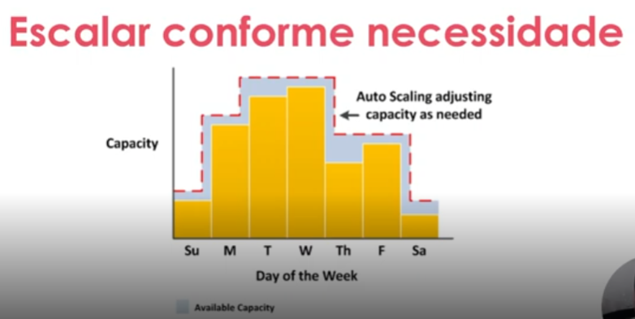
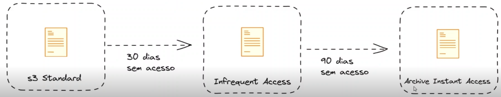
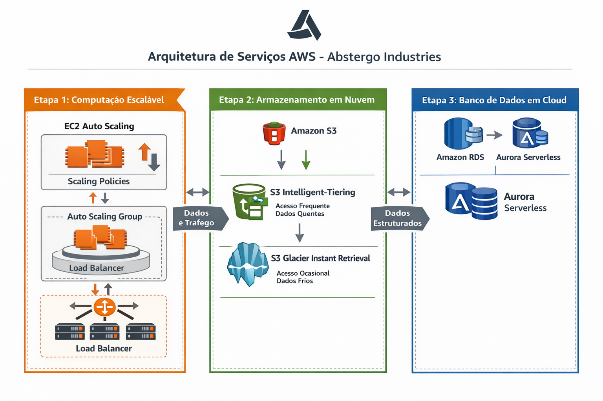

# RELATÓRIO DE IMPLEMENTAÇÃO DE SERVIÇOS AWS

Data: 20/04/2026

Empresa: Abstergo Industries 

Responsável: Cauã Benini

## Introdução
Este relatório apresenta o processo de implementação de ferramentas na empresa Abstergo Industries , realizado por Cauã Benini. O objetivo do projeto foi elencar 3 serviços AWS, com a finalidade de realizar diminuição de custos imediatos.

## Descrição do Projeto
O projeto de implementação de ferramentas foi dividido em 3 etapas, cada uma com seus objetivos específicos. A seguir, serão descritas as etapas do projeto:

### Etapa 1 - Implementação de instâncias em cloud: 
- **Ferramenta:** Elastic Compute Cloud (EC2) AutoScaling
- **Foco da Ferramenta:** Fornecer capacidade computacional (CPU, Memória, Rede, Armazenamento, SO) segura e redimensionável.
- **Descrição:** Tendo em vista o grande volume de dados processados de forma constante pela indústria, optou-se por uma instância AWS otimizada para armazenamento, a fim de garantir estabilidade na leitura e escrita de grandes volumes da dados (eg. informações logísticas, transações comerciais, lista de materiais).

    Fora isso, para garantir otimização de custos, optou-se por utiliar o serviço EC2 AutoScaling com scaling dinâmico, que redimensiona o volume de instâncias de acordo com a demanda de recursos computacioanais.
    

### Etapa 2 - Implementação de armazenamento em cloud: 
- **Ferramenta:** Amazon S3 (Simple Storage Service)
- **Foco da Ferramenta:** Implementação de um sistema de armazenamento de objetos em cloud com disponibilidade e tempo de leitura/escrita adequados ao seu caso de uso, assim garantindo custo otimizado
- **Descrição:** 

    1. Para dados de acesso constante (eg. listas de materiais/produtos, Planilhas de estoque e logística), utilizar o **S3 Inteligent - Tiering**, que gerencia automaticamente o ciclo de vida dos objetos armazenados otimizando custos.
    
    2. Para dados acessados com menor recorrência (eg. Documentos regulatórios, Registros de lotes de produção), mas que ainda precisam de recuperação rápida, optou-se pelo **S3 Glacier Instant Retrieval**, que possui custo menor que o anterior, mas também menor taxa de recuperação.

### Etapa 3 - Implementação de Banco de Dados em cloud:
- **Ferramenta:** Amazon RDS com Amazon Aurora (dados estruturados)
- **Foco da Ferramenta:** Prover um banco de dados relacional  escalável totalmente autogerenciado com custo consideravelmente abaixo do mercado (eg. PostgreeSQL e MySQL).
- **Descrição:** Considerando a necessidade da empresa em lidar com dados estruturados (eg. transações comerciais, logística, estoque), optou-se pelo uso do **Amazon RDS** para gerenciamento de bancos relacionais. Para cargas de trabalho variáveis, foi implementado o **Amazon Aurora**, que ajusta automaticamente a capacidade conforme a demanda, reduzindo custos em períodos de baixa utilização. Essa solução garante alta disponibilidade, replicação automática e performance superior em comparação a bancos tradicionais.

## Conclusão
A implementação de ferramentas na empresa Abstergo Industries tem como esperado uma infraestrutura cloud otimizada, segura e escalável, o que aumentará a produtividade e eficiência da empresa. Recomenda-se a continuidade da utilização das ferramentas implementadas e a busca por novas tecnologias que possam melhorar ainda mais os processos da empresa.

## Anexos

[lista de anexos, como manuais, documentos, planilhas, entre outros]

Assinatura do Responsável pelo Projeto:

Cauã Benini